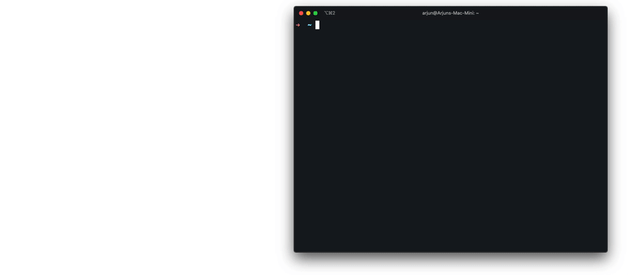

# Playwright

## 소개

`Playwright`는 마이크로 소프트웨어가 개발하고 있는 Node.js 오픈소스 라이브러리로 `Chromium`, `Firefox`, `Webkit`과 같은 모던 브라우저에 대해서 웹 자동화를 지원합니다.

`Playwright`의 목표는 E2E 테스트 자동화를 위한 좀 더 쾌적한 도구를 제공하는 것입니다. 

이를 위해서 `Playwright` 위에서 구동되는  `@playwright/test` E2E 테스트 프레임워크를 제공합니다.

### E2E 테스트란?

기존의 `단위 테스트`, `통합 테스트`의 경우, 모듈 혹은 모듈들에 대한 조합에 대해서 테스트를 하고 그 외의 네트워크 계층, API, DB와 같이 모듈 외부의 디펜던시에 대해서는 모킹을 통해 독립적으로 만듭니다.

하지만 `E2E 테스트`는 실제 앱을 사용하는 사용자의 행동에 대해 테스트를 하기 위해서 실제 브라우저 환경에서 UI 변경 사항 및 시스템 전반에 대해서 테스트를 진행합니다.


## 특징

### 크로스 브라우저 지원

Playwright는 `Chromium`, `Firefox`, `Webkit`과 같은 모던 브라우저에 대해서 웹 자동화를 지원합니다.

`devices`를 통해서 원하는 브라우저를 선택할 수 있습니다.
```ts
import {devices, PlaywrightTestConfig} from "@playwright/test";

const config: PlaywrightTestConfig = {
  use: { 
    ...devices['Desktop Safari'] 
  },
}
```

### Auto-waiting
`Playwright`는 특정 액션을 동작하기 전에 그 액션이 동작할 수 있는지에 대해서 `element`의 상태를 몇가지 검사를 진행합니다. 그 검사를 통과할 때 까지 자동으로 대기한 후에, 검사 통과 후 액션을 동작을 시킵니다.

아래의 예시같은 경우, `확인`이라는 텍스트를 가진 `button element`가 5가지 검사를 통과할 때 까지 `click`이라는 액션을 보류합니다.

```ts
test("test 1", async ({ page }) => {
  await page.locator("button:has-text('확인')").click()
})
```

* Attached: `DOM`에 존재
* Visible: `visibility` 속성이 `visible`
* Stable: 연속된 2 프레임 동안에 같은 위치에 존재
* Enabled: `disabled` 속성이 `false` 
* Receives Events: 이벤트 캡쳐링을 포함한 엘리먼트가 이벤트 수신 가능

위에 검사 과정을 통과한 후에, `click` 액션을 동작시킵니다.

검사를 통과 못할 경우, `timeout error`를 발생시키고 테스트는 실패합니다.

### Authentication
Playwright는 각 테스트들을 독립적인 환경에서 실행하지만 로그인 상태와 같이 전역적으로 중복되어 사용되는 상태를 위한 전략들을 제공합니다.

기본적인 방법은 `beforeEach`와 같은 훅을 사용해서 각 테스트에 로그인 상태를 주입하는방법입니다.
하지만 이 방법은 테스트마다 로그인해야되기 때문에 테스트 속도를 늦추게 됩니다.

```ts
import { test } from '@playwright/test';

test.beforeEach(async ({ page }) => {
  // Runs before each test and signs in each page.
  await page.goto('https://github.com/login');
  await page.click('text=Login');
  await page.fill('input[name="login"]', 'username');
  await page.fill('input[name="password"]', 'password');
  await page.click('text=Submit');
});

test('first', async ({ page }) => {
  // page is signed in.
});

test('second', async ({ page }) => {
  // page is signed in.
});
```

위와 같은 문제점을 해결하기 위해서, Playwright는 로그인 상태를 `json` 형태로 저장하고 이를 이용해서 로그인 상태가 필요한 테스트에서 사용하는 전략을 제공합니다.

일반적으로, 로그인 상태는 `localstorage`, `cookie storage`에 저장시키기 때문에 Playwright는 `localstorage`, `cookie storage` 상태를 `json` 형태로 저장하고 필요할 때 테스트 환경에 로드시킵니다.
```ts
// global-setup.ts
import { chromium, FullConfig } from '@playwright/test';

async function globalSetup(config: FullConfig) {
  const browser = await chromium.launch();
  const page = await browser.newPage();
  await page.goto('https://github.com/login');
  await page.fill('input[name="user"]', 'user');
  await page.fill('input[name="password"]', 'password');
  await page.click('text=Sign in');
  // Save signed-in state to 'storageState.json'.
  await page.context().storageState({ path: 'storageState.json' });
  await browser.close();
}

export default globalSetup;

// playwright.config.ts
import { PlaywrightTestConfig } from '@playwright/test';

const config: PlaywrightTestConfig = {
  globalSetup: require.resolve('./global-setup'),
  use: {
    // Tell all tests to load signed-in state from 'storageState.json'.
    storageState: 'storageState.json'
  }
};

export default config;
```

Playwright는 세션 스토리지를 위한 API는 따로 제공하지 않기 때문에 세션 스토리지에 로그인 상태를 저장하는 경우에는 아래와 같은 `snippet`을 통해서 세션 스토리에 저장되어 있는 상태를 save/load 할 수 있습니다.
```ts
// Get session storage and store as env variable
const sessionStorage = await page.evaluate(() => JSON.stringify(sessionStorage));
process.env.SESSION_STORAGE = sessionStorage;

// Set session storage in a new context
const sessionStorage = process.env.SESSION_STORAGE;
await context.addInitScript(storage => {
  if (window.location.hostname === 'example.com') {
    const entries = JSON.parse(storage);
    for (const [key, value] of Object.entries(entries)) {
      window.sessionStorage.setItem(key, value);
    }
  }
}, sessionStorage);
```

### Parallelism
Playwright에서 기본적으로 테스트 파일 개수만큼의 `worker process`를 생성하여 동시에 실행되고 파일 안에 있는 테스트들은 순서대로 실행합니다.

아래의 예시의 경우 다음과 같이 동작합니다.
* `suite 1` 과 `suite 2` 병렬로 실행
* 각각의 `test 1`, `test 2`, `test 3` 순서대로 실행

```ts
// suite1.spec.ts
test.describe("suite 1", () => {
  test("test 1", () => {})
  test("test 2", () => {})
  test("test 3", () => {})
})

// suite2.spec.ts
test.describe("suite 2", () => {
  test("test 1", () => {})
  test("test 2", () => {})
  test("test 3", () => {})
})
```
단일 파일에 있는 테스트들이 서로 독립적이라면, `test.describe.parallel`을 통해서 동시 테스트가 가능합니다.

단일 파일에서의 동시 테스트의 경우, 분리된 워커 프로세스 환경에서 작동함으로 전역 변수, 상태를 공유하지 못함으로 필요하다면 `beforeAll`이나 `afterAll`을 사용해야됩니다.

```ts
import { test } from '@playwright/test';

test.describe.parallel('suite', () => {
  test.beforeAll(() => {
    // ... something
  })
  
  test.afterAll(() => {
    // ... something
  })
  
  test('runs in parallel 1', async ({ page }) => { /* ... */ });
  test('runs in parallel 2', async ({ page }) => { /* ... */ });
});
```
`config` 파일의` projects` 옵션을 통해서 각각의 다른 브라우저 환경에서의 동시 테스트를 진행할 수도 있습니다.

```ts
import {devices, PlaywrightTestConfig} from "@playwright/test";

const config: PlaywrightTestConfig = {
  projects: [
    {
      name: "chromium",
      use: { ...devices["Desktop Chrome"]}
    },
    {
      name: "firefox",
      use: { ...devices["Desktop Firefox"]}
    },
    {
      name: 'webkit',
      use: { ...devices['Desktop Safari'] },
    },
  ]
}
```
<br />

### Test Generator 
`codegen`을 통해서 좀 더 빠르게 테스트 코드를 작성할 수 있게끔 도와줍니다.

```shell
# cli
npx playwright codegen wikipedia.org

# package.json
playwright codegen wikipedia.org
```




## 참고 문서
* [공식 문서](https://playwright.dev/)
* [Github](https://github.com/microsoft/playwright)
* [Microsoft Announces Playwright Alternative to Puppeteer](https://www.infoq.com/news/2020/01/playwright-browser-automation/)
